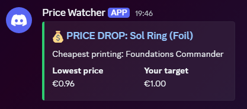
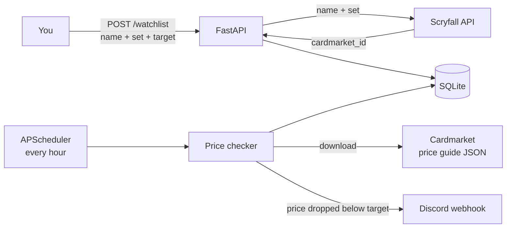

# Cardmarket Price Watcher

Get a Discord alert when a Magic: The Gathering card drops below your target price on Cardmarket.

A FastAPI service that keeps a watchlist of cards, checks them every hour against Cardmarket's official daily price guide, stores the price history, and posts a Discord message when a card's lowest price falls below the threshold you set.



## Features

- **Web interface**: add cards through a form and see your watchlist with the latest prices
- **Watchlist API**: add a card by name and set code, list cards with their latest price, remove cards
- **Scheduled price checks**: an hourly job that only does real work when Cardmarket publishes a new price guide
- **Discord alerts**: sent once when the price drops below your target, not every hour it stays there
- **Price history**: every check and every alert per card, oldest first
- **Foil and non-foil** printings are tracked separately
- **36 tests** that run offline in under a second, without touching the real database or external services

## How it works



1. **Adding a card**: Scryfall resolves the name and set to Cardmarket's product ID. The same card can have dozens of printings (Sol Ring has 146 on Cardmarket), so the set code matters.
2. **Checking prices**: the scheduler downloads Cardmarket's price guide (one JSON file with prices for every product), keeps only the cards on the watchlist and stores a price check for each.
3. **Alerting**: if a card's lowest price crossed from above to at or below the target, a Discord embed is sent and the alert is recorded.

## From scraper to official feed

This project started as a web scraper for Cardmarket product pages. A quick spike showed that Cardmarket sits behind Cloudflare bot protection: both `httpx` and `curl_cffi` (which imitates a real browser's TLS fingerprint) were served a challenge page. Going further would have meant a headless browser and an arms race with Cloudflare, and Cardmarket's terms don't allow scraping anyway.

Instead, the app now uses the [price guide Cardmarket publishes for all users](https://news.cardmarket.com/en/Magic/were-making-the-price-guide-and-product-catalogue-available-for-download), combined with [Scryfall](https://scryfall.com/docs/api) to map card names to Cardmarket product IDs. This is more reliable, respects the platform, and needs one download per check instead of one request per card.

## Design decisions

- **Alert on the crossing, not the state.** An alert fires only when the previous check was above the target and the current one is at or below it. You get one message per deal instead of one every hour.
- **Compare against the lowest price.** The `low` price is what you could buy the card for right now. `trend` and the 30-day average are stored as well for context.
- **`Decimal` for money.** Floats make comparisons like `19.999999 <= 20.00` unreliable. Prices from the JSON feed are converted via `Decimal(str(value))` to avoid float artefacts.
- **Skip unchanged feeds.** Every price check stores the feed's `createdAt`. If the feed hasn't changed since the last check, the card is skipped, so the job can safely run hourly without duplicate rows or alerts.
- **Commit first, notify second.** Prices are saved before any Discord message is sent, so a failing webhook never loses price data.
- **Pure functions where possible.** The alert rule, price parsing and message formatting have no I/O, which keeps most tests trivial and fast.

## Tech stack

FastAPI · SQLModel · SQLite · APScheduler · httpx · Pydantic · Pytest · respx · Ruff

## Getting started

Requires Python 3.12 or newer.

```bash
git clone https://github.com/Cak3IsLov3/cardmarket-price-watcher.git
cd cardmarket-price-watcher

python -m venv .venv
.venv\Scripts\activate          # Windows
# source .venv/bin/activate     # macOS / Linux

pip install -r requirements.txt
cp .env.example .env            # Windows: copy .env.example .env
```

Create a webhook in Discord (channel settings → Integrations → Webhooks → New Webhook), copy its URL into `DISCORD_WEBHOOK_URL` in `.env`, then start the server:

```bash
uvicorn app.main:app --reload
```

Open http://127.0.0.1:8000 for the web interface, or http://127.0.0.1:8000/docs for the API in Swagger UI. The first price check runs right after startup.

> **Run a single worker.** Each Uvicorn worker starts its own scheduler, so `--workers 4` would run four price checks and could send duplicate alerts.

## Configuration

| Variable | Default | Description |
|---|---|---|
| `DISCORD_WEBHOOK_URL` | *(empty)* | Webhook for alerts. Without it, alerts are skipped and a warning is logged. |
| `CHECK_INTERVAL_HOURS` | `1` | How often the price check runs. |
| `DATABASE_URL` | `sqlite:///./pricewatcher.db` | SQLAlchemy database URL. |
| `PRICE_GUIDE_URL` | Cardmarket MTG price guide | Source of the daily prices. |
| `SCRYFALL_USER_AGENT` | `CardmarketPriceWatcher/0.1` | User-Agent sent to Scryfall, as their API requires. |

## API

The web interface at `/` is a small HTML/JavaScript page (`app/static/`) that uses the same endpoints.


| Method | Endpoint | Description |
|---|---|---|
| `POST` | `/watchlist` | Add a card: `{"name": "Sol Ring", "set_code": "cmm", "target_price": "1.00", "foil": false}` |
| `GET` | `/watchlist` | All cards with their latest price |
| `DELETE` | `/watchlist/{card_id}` | Remove a card and its history |
| `GET` | `/watchlist/{card_id}/history` | All price checks and alerts for a card |
| `POST` | `/watchlist/check` | Run a price check now instead of waiting for the scheduler |

Errors return `{"detail": "..."}`: `404` for an unknown card, `409` for a card that's already on the watchlist, `422` for invalid input, and `502` when Scryfall or Cardmarket can't be reached.

## Tests

```bash
pytest -v
ruff check .
```

- **Unit tests** for the alert rule, price parsing, Scryfall parsing and the Discord message
- **HTTP tests** with [respx](https://lundberg.github.io/respx/) for Scryfall and price guide failures (404, 5xx, network errors)
- **API tests** with FastAPI's `TestClient` against an in-memory SQLite database, including the full flow of adding a card, checking prices, and asserting that Discord is called exactly once

Test data in `tests/sample_data.py` is taken from real Scryfall and Cardmarket responses.

## Limitations and ideas

- **Missed alerts aren't retried.** If the Discord webhook fails, that alert is lost, because the next check no longer sees a crossing. A retry queue would fix this.
- **No condition or language filter.** The price guide is an aggregate across all conditions and languages, so `low` can be a played or foreign copy.
- **Prices update daily**, since that's how often Cardmarket refreshes the guide.
- **Ideas**: bulk import from an Archidekt decklist, a chart of the price history, Docker, deployment to Railway or Fly.io, PostgreSQL, GitHub Actions CI.

## Disclaimer

Personal learning project, not affiliated with Cardmarket or Scryfall. Prices come from Cardmarket's public price guide and card data from the Scryfall API.
